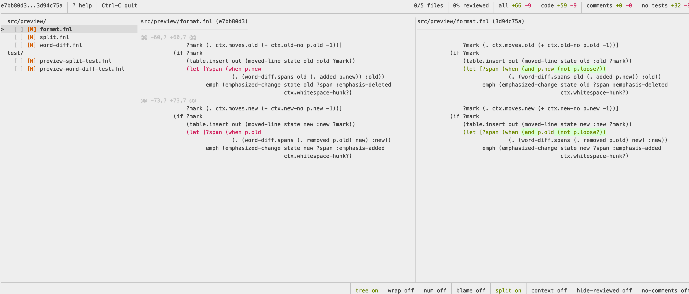

# gdiff

gdiff is a terminal tool for reviewing Git changes. Changed files are on the left, the diff is on the right. You move with vim keys, search, switch between unified and side-by-side view, and open a file in your editor when you need more context.



## Why

AI writes more and more of the code that lands in a repository. That code compiles, passes tests, and looks fine at a glance. Whether it does the right thing is a question only a human review can answer. Review is now the main place where a person actually reads the code before it ships.

That means reading a lot more diffs than before. gdiff is built for that: a diff view similar to delta, vim keys for moving around, search, and a quick way to open the file in an editor when the diff alone is not enough.

## Main features

- Vim keys: `j` / `k`, `gg` / `G`, `/` to search, `n` / `N` to jump between matches.
- Diffs are loaded in the background, so moving between files does not wait for git.
- Word-level highlighting shows which part of a line changed, similar to delta.
- Unified or side-by-side view, toggled with one key. In side-by-side mode a changed line sits next to its old version.
- Moved lines are shown in their own color with a note like `(moved to lines 120-134)` instead of a plain delete plus add.
- Moved files are detected when Git missed the rename. The file list shows `(moved to new/path, 87%)` on the old file and `(moved from old/path, 87%)` on the new one.
- Whitespace-only hunks are marked.
- Search in the diff and in the file list.
- Blame: one key adds a gutter with the commit date and author for every line, in both unified and side-by-side view.
- Full context: one key switches the diff from hunks to the whole file with the changes highlighted in place.
- Hide comments: one key hides comment lines from the diff. Changed comment lines are also colored differently from changed code when shown.
- Toggles for line numbers and line wrapping.
- Resizable split between the file list and the diff.
- Header stats: added and deleted lines in total, for code only, for comments only, and outside test files.
- Diff a revision range, a branch against main or master, the working tree, two files, or two folders.
- Review a GitHub pull request by URL. gdiff fetches the PR refs, so the diff matches what GitHub shows even without the branch locally.
- Flat file list or a file tree with folders you can expand and collapse.
- Colored status for every file: added, modified, deleted, renamed, copied, untracked.
- Open the file in your editor at the current version, the base version, or the version on disk.
- GUI editors such as IntelliJ IDEA, VS Code, or Cursor open in the background while gdiff keeps running. Terminal editors take over the screen and return to gdiff when closed.
- Select lines and copy them, plain or fenced with the file path.
- Copy the relative or full path of a file.
- Open the pull request or the commit for a line on GitHub.
- Mark files as reviewed and hide them. Marks are saved on disk, so you can stop and continue later.
- Images, PDFs, and other binary files are listed but skipped in the preview.

## Requirements

- `git`
- `fennel` on your `PATH`
- `gh` when you review pull requests by URL
- A clipboard command for copying lines and paths: `pbcopy` on macOS, `wl-copy` on Wayland, `xclip` or `xsel` on X11.

## Install

Clone the repository and put `bin/gdiff` on your `PATH`, for example with a symlink:

```sh
git clone https://github.com/evmorov/gdiff.git ~/projects/gdiff
ln -s ~/projects/gdiff/bin/gdiff ~/.local/bin/gdiff
```

## Usage

Inside a repository, compare the current branch with main or master:

```sh
gdiff
```

Compare two revisions:

```sh
gdiff main HEAD
gdiff v1.2.0 v1.3.0
```

Review uncommitted changes in the working tree:

```sh
gdiff w
```

Review a pull request:

```sh
gdiff https://github.com/owner/repo/pull/123
```

Compare two files or two folders outside of Git:

```sh
gdiff old.txt new.txt
gdiff old-dir new-dir
```

Use another editor for one run:

```sh
gdiff -e nvim main HEAD
gdiff --editor "idea --wait" main HEAD
```

Press `?` inside gdiff to see all keyboard shortcuts. Run `gdiff --help` for the command-line options.

## Configuration

The config file lives at `~/.config/gdiff/config.fnl`, or under `XDG_CONFIG_HOME` when it is set. The editor can be a command string:

```fennel
{:editor "idea --wait"}
```

Or a list, which is safer when the path contains spaces:

```fennel
{:editor ["/Applications/IntelliJ IDEA.app/Contents/MacOS/idea" "--wait"]}
```

Without a config file gdiff uses `GDIFF_EDITOR`, then `VISUAL`, then `EDITOR`, then `vim`. The `--editor` option overrides all of them for one run.

gdiff runs known GUI editors in the background and terminal editors in the foreground. Set `:detached` to force one or the other:

```fennel
{:editor "my-editor" :detached true}
```

Review marks are stored in `~/.local/state/gdiff/reviews.fnl`, or under `XDG_STATE_HOME` when it is set.

## Development

Run the tests with:

```sh
bin/test
```

See `AGENTS.md` for contributor notes.
